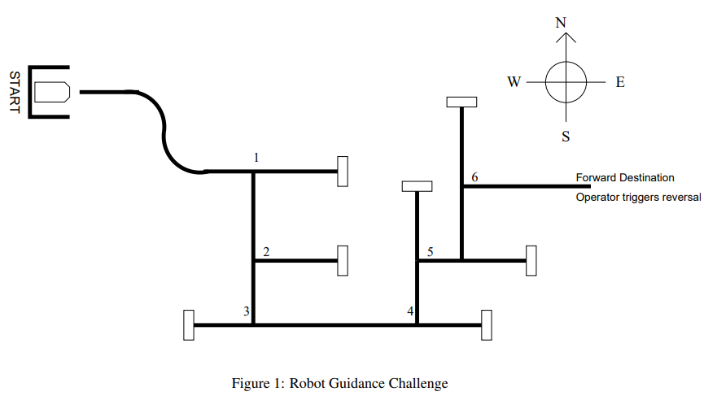

# Robot Navigation System

The EEBOT makes use of the HCS12 microcontroller system in order to traverse the maze shown below. All  
tasks, using its arsenal of input and output devices, are carried out according to instructions. 
These input devices consist of a front and back bumper sensor, as well as line sensors as LEDs. As for 
output devices, components like the LCD display and motor control are vital to ensure input and output 
device synchronization results in an effective navigating bot.

The front and back bumpers serve the purpose of detecting dead ends in the maze. Upon detection, a 
subroutine is called, employed through a dispatcher serving as an FSM, which causes the bot to do a 180° 
turn, ensuring its movement can be retracted until a previous junction point, whereby the bot will now 
navigate the other electrical tape path. The usage of a dispatcher to carry out state transitions ensures 
correct decision-making without retaking previously traversed paths in the maze.

The line sensors, which consist of both LEDs as well as five photoresistors, give the bot instructions to 
traverse the black electrical tape as previously mentioned. Ensuring that the centre of the bot is aligned 
with the tape as it moves is exactly how the maze is traversed. At junction points, the bot is programmed 
to always make a left turn, meaning that it may come across dead ends, thus working in conjunction with 
the front and back bumpers is necessary as described in the previous paragraph. This hard-coded left turn 
is called through a subroutine in the program, which enables a consistent following mechanism.

Additional code was implemented to integrate line-following logic and manage event-based subroutine calls, 
in order to make sure all known edge cases were covered. Additionally, a dedicated section of the code was 
developed to display the robot's current state, providing real-time insight into its operational status 
during navigation, which proved very useful in debugging and resolving issues. Critical functionalities 
consisted of smooth turning, controlled speed adjustments, state transitions, and an analog to 
digital converter. A video of the EEBOT in action can be located below.

[Robot In Action](https://drive.google.com/file/d/15_QNJw0n_y85UpUGep_cG59tpDNHYpJF/view?usp=sharing)
